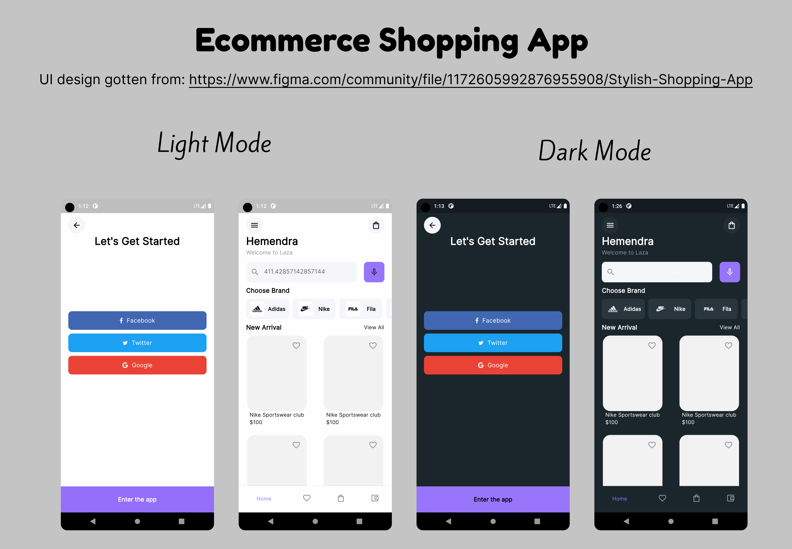

# Ecommerce Shopping App
#### This is an ecommerce app that perfectly imlements ```light mode``` and ```dark mode ``` and it manages its state using <a href="https://pub.dev/packages/provider"> Provider</a> using a switch button to store the current value(false for light, true for dark) using shared preferences so that when the user enters the app again their previous mode preferences are loaded using <a href="https://pub.dev/packages/shared_preferences">Shared preferences</a>

